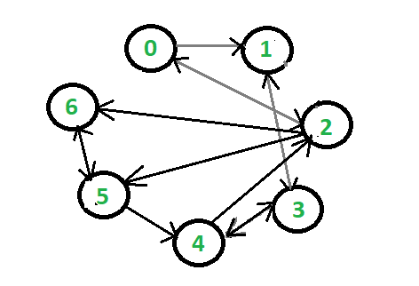

# Graphs
* graph G ( V , E ) is a collection of vertices(nodes) and edges.

* Used to model Paths in a city , social networks ,website backlinks , internal employee network , etc.

* A vertex or node is one fundamental unit / entity of which graphs are formed




`An edge is uniquely defined by its 2 endpoints`
```
1. Directed Edge -- One way connection
2. Undirected Edge -- Two way connection

3. Directed Graph -- All directed edges
4. Undirected Graph -- All undirected edges
```


## `Indegree & Outdegree of a node(vertic)`
```
Indegree -- no of ages going into os a node
Outdegree -- no of ages going out os a node
```


## `Facebook - A Graph of Users`


* Graphs are used to model relationships
between nodes

* We can apply graph algorithms to suggest
friends to people , calculate no of mutual
friends etc.


## `Methods:`

## `Graph Traversal`
* graph traversal refers to the process of visiting each vertex in a graph.
* used to searching a vertex in a graph.

`Two algorithms of graph traversal are`
1. Breadth first search (BFS)
2. depth first search (DFS)


### 1. `BFS`
* it is a traversal algorithm that is used for searching the tree or graph layer by laye